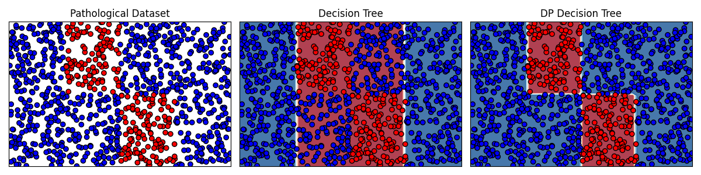
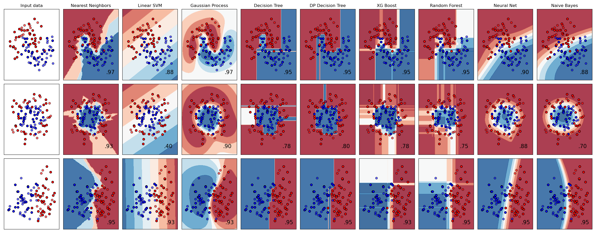

Dynamic Programming Decision Trees
============================================================


[](https://codecov.io/gh/scikit-learn-contrib/project-template)


### A new tree-based estimator.
```bash
pip install git+https://github.com/KohlerHECTOR/DPDTreeEstimator
```
```python
from sklearn.datasets import load_iris
from sklearn.model_selection import train_test_split
from sklearn.tree import DecisionTreeClassifier
from dpdt import DPDTreeClassifier

X, y = load_iris(return_X_y=True)
X_train, X_test, y_train, y_test = train_test_split(X, y, test_size=0.33, random_state=42)

CART = DecisionTreeClassifier(max_depth=3, random_state=42)
DPDT = DPDTreeClassifier(max_depth=3, random_state=42)
CART.fit(X_train, y_train)
DPDT.fit(X_train, y_train)

assert DPDT.score(X_train, y_train) >= CART.score(X_train, y_train), 'DPDT does not have better train accuract than CART'
print(f'CART test accuracy={CART.score(X_test, y_test)}')
print(f'DPDT test accuracy={DPDT.score(X_test, y_test)}')
```
### A pathological classification problem for trees.

### Comparison of different classifiers.

