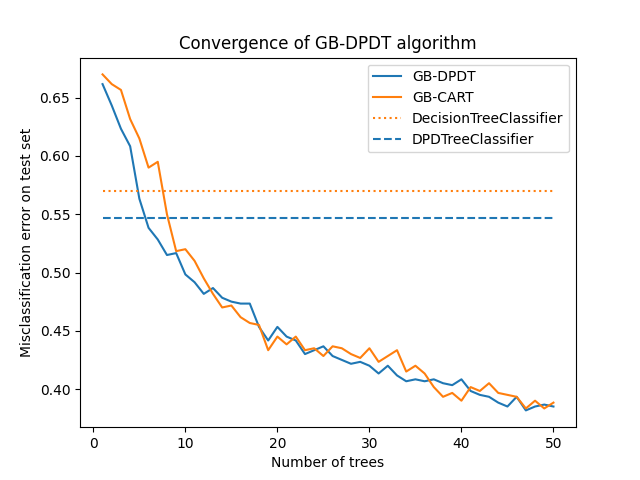

Dynamic Programming Decision Trees
============================================================

### A new tree-based estimator.
### A pathological classification problem for trees.

### Comparison of different classifiers.

### Gradient Boosting

